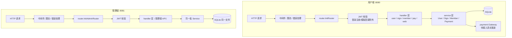
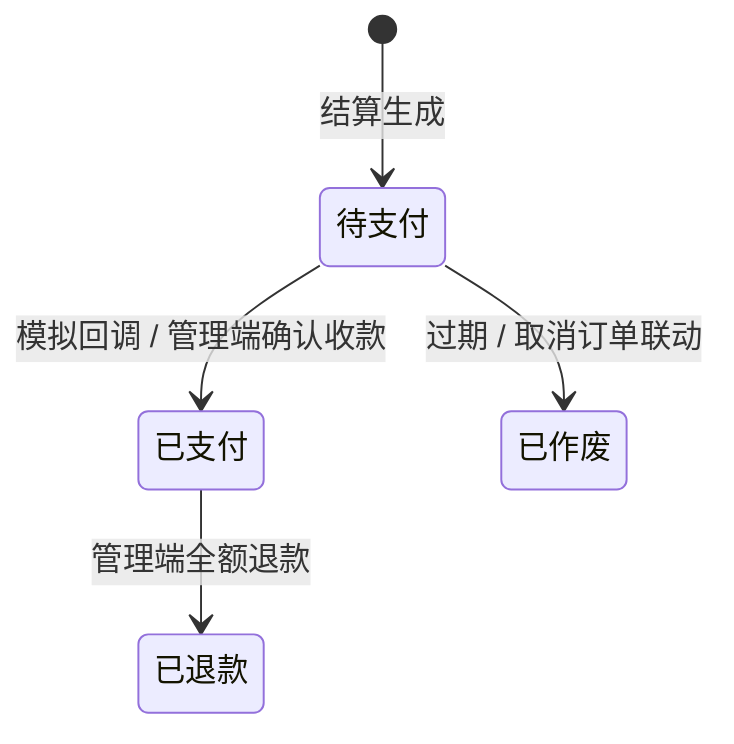
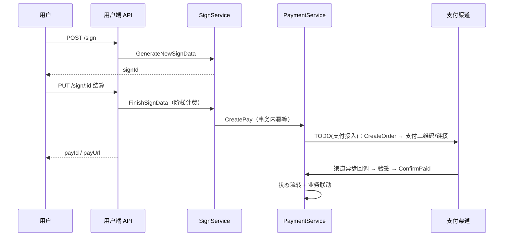

# Gubill 架构文档

## 系统概览

单一进程、双端口运行：

| 服务 | 端口 | 职责 |
|------|------|------|
| 用户服务 | `:8080` | 注册/登录、签到计费、会员购买、支付记录 |
| 管理服务 | `:8081` | 管理端 API |

**技术栈**：Go 1.26+ ｜ Gin ｜ GORM v2 + SQLite（`gorm.io/driver/sqlite`，CGO）｜ JWT（HS256）｜ bcrypt

## 分层架构

| 层 | 位置 | 职责 |
|----|------|------|
| 路由层 | `internal/router` | 路由注册、服务组装、中间件挂载 |
| 中间件 | `internal/middlewares` | 限流、JWT/Bearer 解析、统一错误响应 |
| Handler 层 | `internal/handler` | 参数绑定/校验、响应组装 |
| Service 层 | `internal/service` | 业务规则与事务；`PaymentService` 独占支付状态机 |
| 网关层 | `internal/payment` | `Gateway` 接口，真实支付渠道（微信/支付宝）接入位 |
| 模型层 | `internal/models` | 表结构、状态常量、响应/错误类型 |
| 基础设施 | `repository` / `config` / `utils` | 数据库、配置、工具函数 |

## 数据模型

| 表 | 关键字段 | 说明 |
|----|----------|------|
| `users` | username(唯一), email(唯一), password_hash, role | 管理员角色 `Admin` |
| `signs` | user_id, start_at, end_at, status, value | 签到计时单 |
| `pays` | user_id, business_type, business_id, channel, value, status, expire_time, pay_at, refund_value, refund_at | 统一支付单 |
| `member_plans` | name, type(唯一), value, description | 会员套餐 |
| `member_lists` | user_id(唯一), status, end_at | 会员状态 |
| `member_orders` | plan_id, user_id, value, status | 会员订单 |

## 状态机

- 签到：进行中(0) → 待支付(2) → 已完成(1)
- 会员订单：待结算(0) → 待支付(2) → 已支付(1) / 已取消(-1)
- 支付成功后自动联动业务单；支付过期后可直接重新结算（旧单作废、生成新单）

## 核心流程

### 签到计费 → 支付闭环

### 计费规则

30 分钟 1 个计费单位（向上取整），单价默认 500 分（`SINGLE_PRICE` 可配置）：

| 时长 | 费用 |
|------|------|
| ≤ 12 小时 | 单位数 × 单价，封顶单价 × 10 |
| 12 ~ 24 小时 | 超出部分按单位计 + 单价 × 10，封顶单价 × 20 |
| > 24 小时 | 24 小时整周期封顶 + 剩余时长递归计费 |

## 配置体系

遵循上游约定：**`cmd/main/config.yaml` 为唯一配置源**，启动时由 `config` 包读取并 `os.Setenv` 写入环境变量（含 `JWT.Salt`、`SinglePrice`、`Pay.ExpireMinutes` 等），不可通过环境变量覆盖；仅 `CONFIG_PATH` 可指定配置文件路径。

## 扩展点

1. **真实支付**：实现 `internal/payment.Gateway`（微信/支付宝），在 `main.go` 的 `TODO(支付接入)` 处注入，并新增渠道回调接口。
2. **会员自动开通**：为 `member_plans` 增加时长字段，支付成功后写入 `member_lists`。
3. **生产加固**：HTTPS、CSRF Token、HTTP 超时、可信代理配置。
